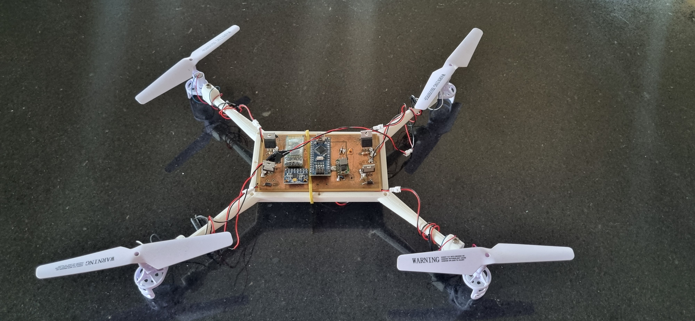
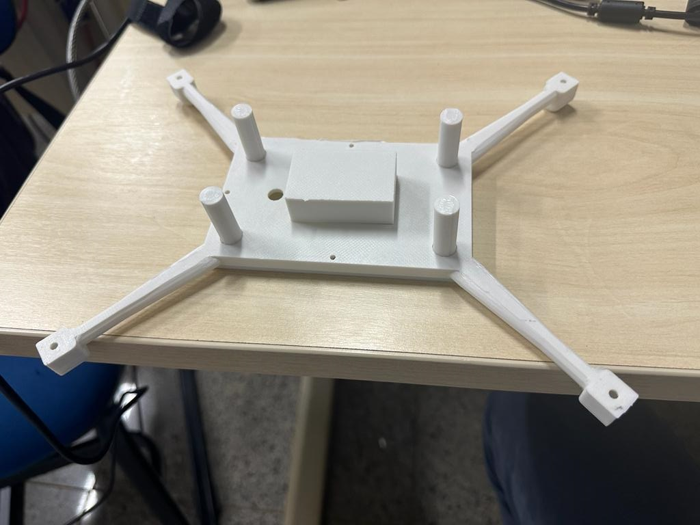
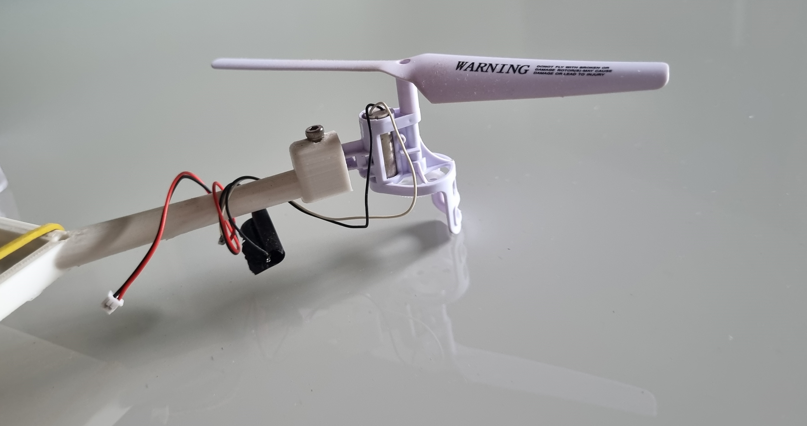
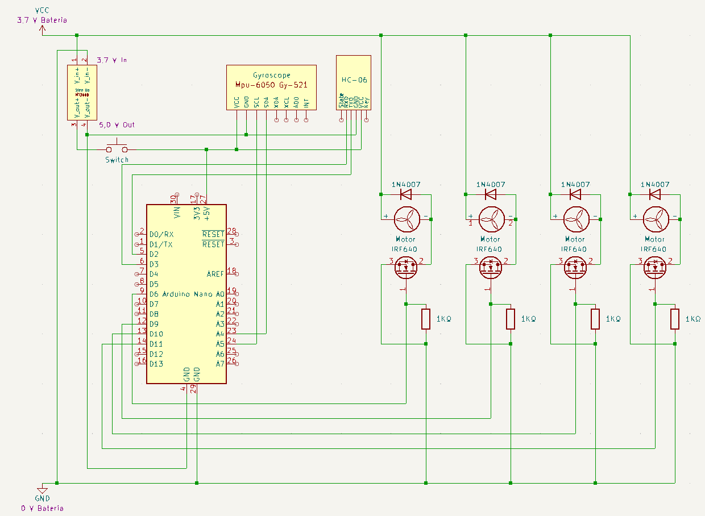
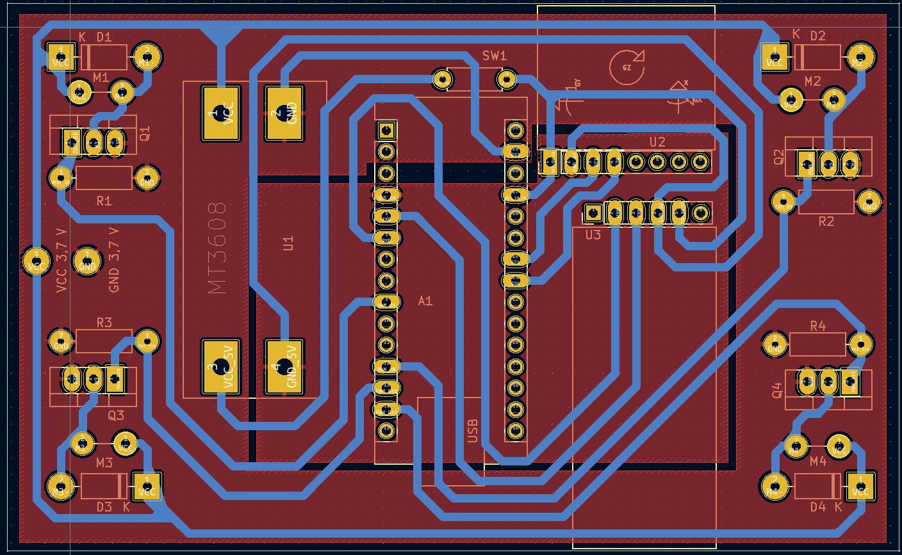
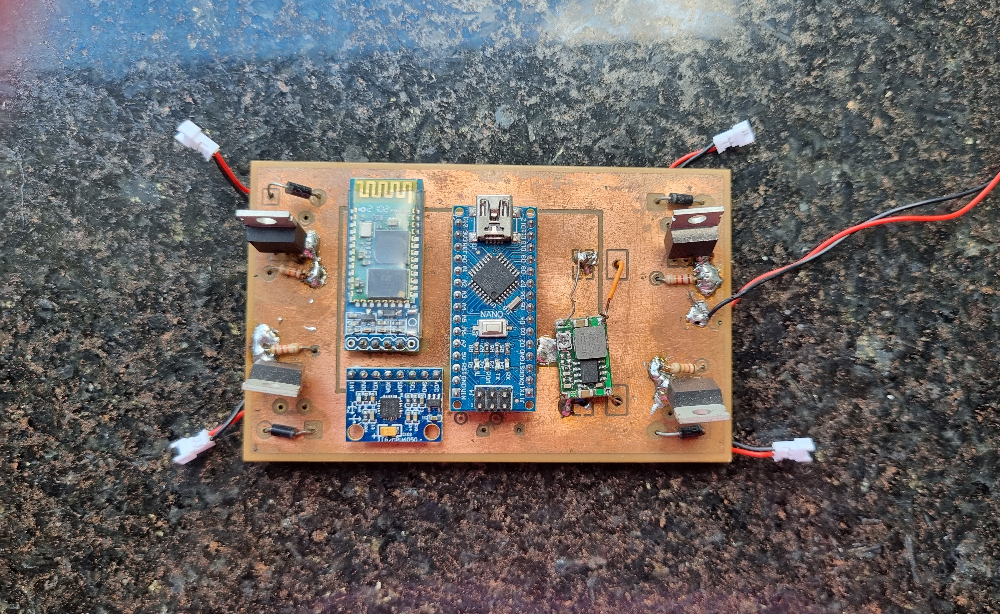
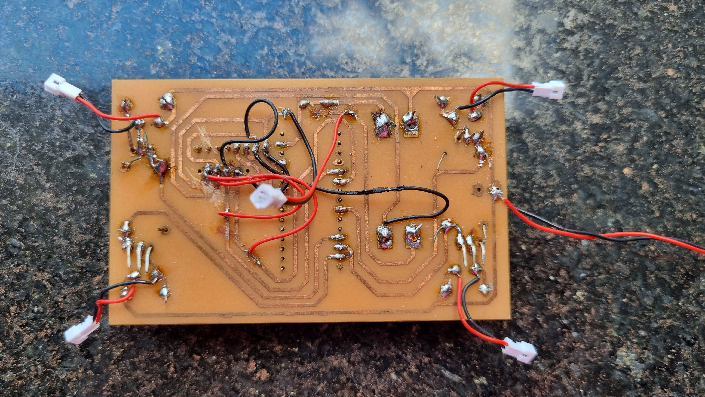
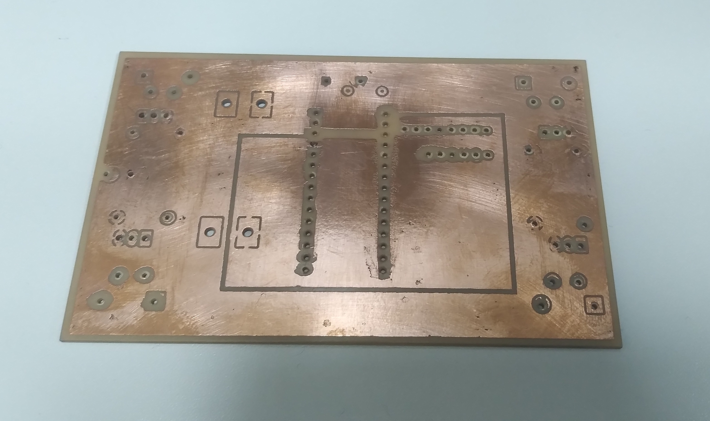

# Galeria De Imagens

## Protótipo inicial

   
  Estrutura inicial usada para demonstrar o controle dos motores.

## Evolução da estrutura

   
  Versão anterior da estrutura.

   
  Versão mais refinada da estrutura.

   
  Vista frontal do drone.

## Peças mecânicas

   
  Carcaça do projeto.

   
  Hélice utilizada.

## Eletrônica

   
  Esquema elétrico do sistema.

   
  Blueprint da PCB.

   
  Face frontal da placa.

   
  Face traseira da placa.

   
  PCB isolada.

## Vídeos de funcionamento

Os testes e demonstrações mais recentes também estão documentados em vídeo:

- [Teste das funções de controle (versão web)](Videos/Video%20-%20Teste%20funcoes%20(web).mp4)
- [Demonstração de voo (versão web)](Videos/Video%20-%20Voo%20(web).mp4)

Arquivos originais (qualidade máxima):

- [Teste das funções de controle (original)](Videos/Video%20-%20Teste%20fun%C3%A7%C3%B5es.mp4)
- [Demonstração de voo (original)](Videos/Video%20-%20Voo.mp4)

## Navegação relacionada

- [Visão geral do projeto](Projeto.md)
- [Construção mecânica e estrutura](Construcao_Mecanica.md)
- [Esquema elétrico e PCB no KiCad](KicadSchemePCB_Reference.md)
