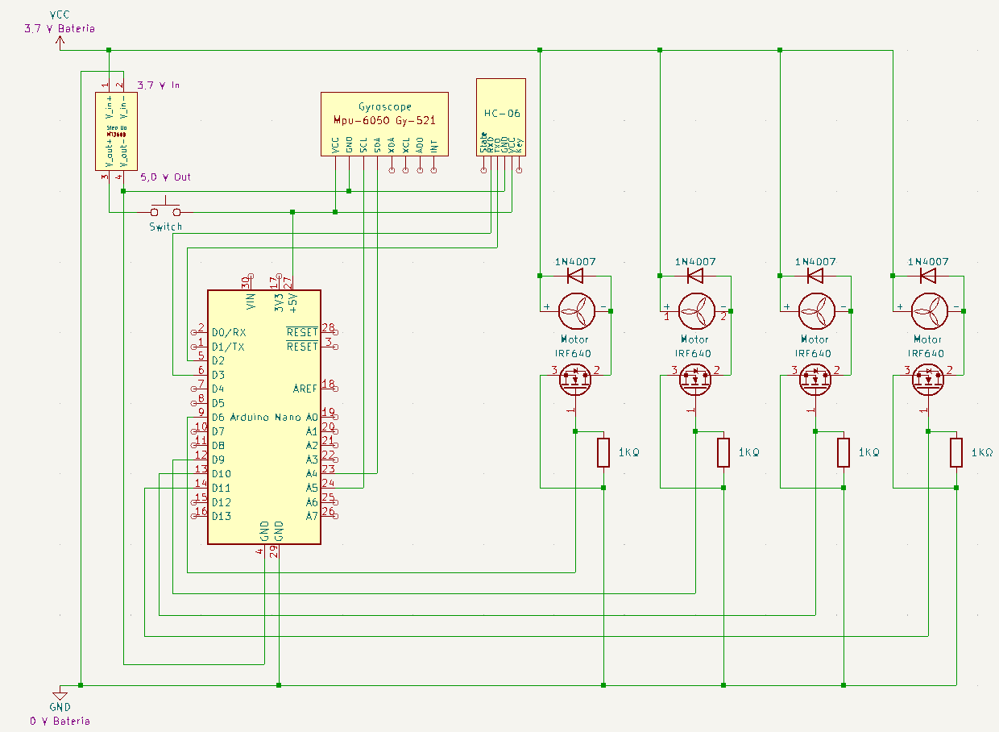

# Informações sobre a construção do projeto

## Início - Pré 2023 
Iniciamos o projeto no ano de 2022 como uma versão "beta" para o TCC, no final desse ano nosso grupo conseguiu uma demonstração de como os motores poderiam ser controlados por um smartphone, nosso "drone"
era apenas uma caixa com quatro motores controlados por um Arduino Nano que recebia sinais de um aplicativo simples feito no MIT App Inventor.

   
  Caixa que demonstrava o funcionamento dos motores.   

Durante esse período compramos os itens que achavá-mos necessários, alguns desses itens acabaram sendo substituídos. 
Fizemos uma planilha com os itens que iriamos comprar: [Planilha](https://github.com/JoseHBB/Zangao-Avarento/blob/main/Planilha%20com%20os%20pre%C3%A7os%202022.xlsx) 
É necessário baixar a planilha pois o Github não consegue mostrar esse tipo de arquivo.

## Início - 2023
Em 2023 começamos com o objetivo de melhorar o que já tinhamos para finalmente construir um drone, nessa etapa já tinhamos uma noção sobre o circuito de controle do motor utilizando MOSFETs e a programação do Arduino para esse controle e recepção de dados de um smartphone via bluetooth.   

### O que iriamos fazer

Começamos primeiro definindo o que precisariamos construir.
- **Carcaça:** Definimos que a carcaça seria feita com impressão 3D devido a disponibilidade do recurso na escola, houveram três prototipos até o que foi utilizado no drone final.
- **Esquema elétrico completo:** Devido a alguns problemas encontrados no projeto parcial de 2022, percebemos que seria necessário refazer o esquema elétrico dos motores e também adicionar todas as peças que precisariamos para o circuito. 
- **PCI(Placa de Circuito Impresso):** Como seriam necessários vários componentes eletrônicos para o funcionamento do drone optamos pela produção de uma PCI devido a praticidade e a disponibilidade de uma prototipadora na escola.
- **Algoritmo:** Com a utilização de um acelerômetro e giroscópio poderiamos pegar dados de rotação e aceleração do drone, o arduino com um algortimo poderia controlar a potência dos motores deixando o drone mais estável com base nesses dados.
- **Aplicativo:** Seguindo o objetivo de manter um baixo custo iremos utilizar um aplicativo para o controle do drone via bluetooth, o aplicativo foi programado pelo MIT App Inventor.
## Primeiros passos

### Carcaça e peças

Quando começamos a pensar sobre como iriamos fazer a carcaça percebemos que tinhamos que pensar em uma de forma de conectar os motores a carcaça e as hélices aos motores. Nesse momento haviamos cometido um erro, devido a ter comprado essas peças de forma separada e elas seram para reposição de um drone pré-fabricado estavam faltando partes chave para que essas peças conseguisem se encaixar principalmente a parte mecânica que envolvia transferir o movimento do motor para as hélices. 
Decidimos seguir uma rota diferente da planejada, compramos 2 kits de hélices, motores e suportes prontos assim facilitando a construção da carcaça. Com a ajuda de um professor de mecânica conseguimos produzir um protótipo que já estava propenso a testes.

### Esquema e Placa de Circuito Impresso

Sobre a PCI começamos o fazendo o esquema elétrico, foi utilizado o software Kicad 6.0 para o esquema e o blueprint da PCI que iriamos prototipar depois, nesse esquema colocamos todas as conexões que seriam necessárias tanto de potência (motores) e lógica (sensores). Esse processo foi consideravelmente tranquilo devido as nossas aulas de elétrica, a parte mais trabalhosa foi a necessidade de adicionar esquema de peças que não estão por padrão no sistema. 

   
  Esquema elétrico feito no Kicad 6.0.   

### Algoritmo

Como já tinhamos um algoritmo parcial buscamos primeiramente um teste inicial de funcionamento de funções simples como __subir()__ que iria ligar todos os motores em uma alta potência para que o drone ganhe altitude. 

### Aplicativo

Nesse início praticamente não fizemos nada em relação ao aplicativo.
